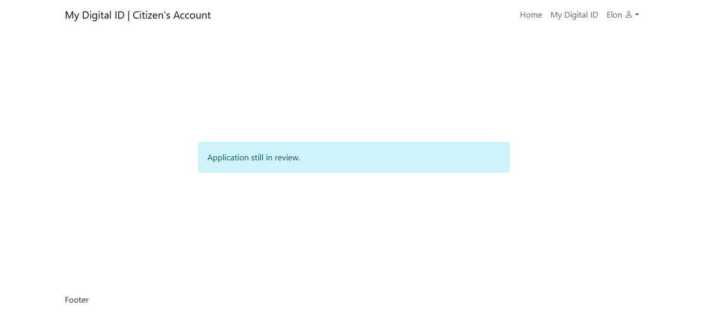
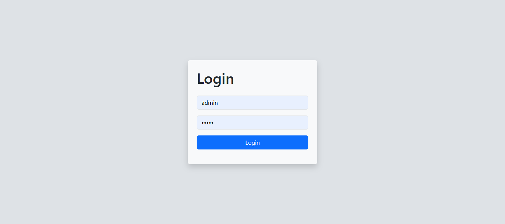

# Digital ID Portal

A super lame school project made in PHP.

## Citizen Side

### Citizen Account Registration

A citizen (user) must create an account first.

 

### Citizen Account Log in

The citizen can then log in after account registration.

 

### ID Application (`My Digital ID` page)

On this page, this is where the citizen can fill out the ID Application form.

 

### After application response

After application, the page will reload and just display pending message.

The application will then be saved to the database, and will be review by the admins.

## Admin Side

### Admin Log in

Log in page for admin.

 

### 

This is where the admin can review the ID applications.

 

If the application is approved, it will simply change the status, alert success message, reload the page, and will return approve message to the citizen account.

Approved application message in citizen account.

 

Same goes for rejected application. Change the status in database, alert success message, reload the page, and return rejected message to the citizen side.

Rejected application response in citizen side.

## Process Flow

